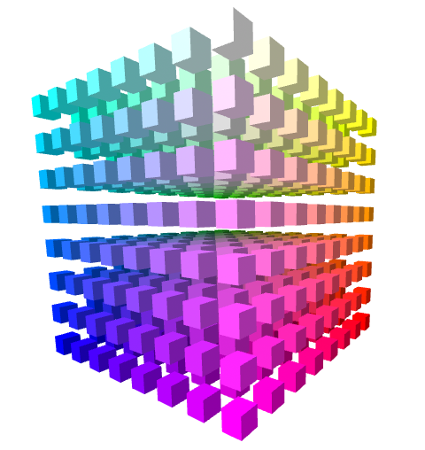

# rgb-in-vr

Archived. This repository was moved to [my own domain](https://jaenis.ch/hobbies/coding/repos/ryuno-ki/rgb-in-vr).

You can [watch a Demo Page](https://ryuno-ki.github.io/rgb-in-vr/).

If you struggle with understanding RGB notation for colours, this repo might
help you.

You will be loaded in the middle of the cubes.

The corners will contain Red, Magenta, Blue, Cyan, Green, Yellow, White and Black.
On the diagonal connecting White and Black you can see shades of grey.
Connecting the lines between the other colours will give you gradient colours.

Control via <kbd>W</kbd>, <kbd>A</kbd>, <kbd>S</kbd>, <kbd>D</kbd> or via look.

## Vertical movement

If there is interest, I might add
[vertical movement](https://github.com/n5ro/aframe-extras/issues/149#issuecomment-389649914)
in the future.

## License

GPL v3 or newer.
